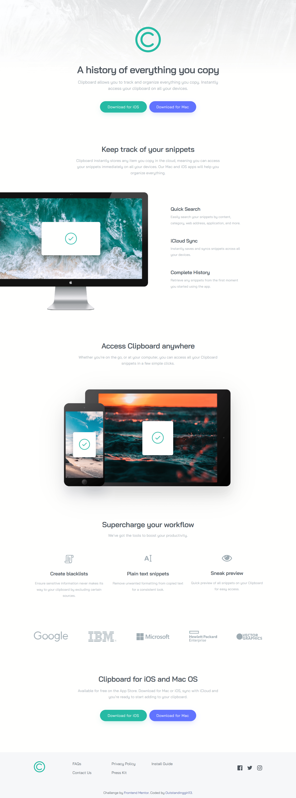

# Frontend Mentor - Clipboard landing page solution

This is a solution to the [Clipboard landing page challenge on Frontend Mentor](https://www.frontendmentor.io/challenges/clipboard-landing-page-5cc9bccd6c4c91111378ecb9). Frontend Mentor challenges help you improve your coding skills by building realistic projects. 

## Table of contents

- [Overview](#overview)
  - [The challenge](#the-challenge)
  - [Screenshot](#screenshot)
  - [Links](#links)
- [My process](#my-process)
  - [Built with](#built-with)
  - [What I learned](#what-i-learned)
- [Author](#author)

## Overview

### The challenge

Users should be able to:

- View the optimal layout for the site depending on their device's screen size
- See hover states for all interactive elements on the page

### Screenshot



### Links

- Solution URL: [Add solution URL here](https://your-solution-url.com)
- Live Site URL: [GitHub Pages](https://outstandinggirl13.github.io/clipboard-landing-page-master/)

## My process

### Built with

- Semantic HTML5 markup
- CSS custom properties
- Flexbox
- CSS Grid
- Mobile-first workflow

### What I learned

1. Background images and viewport sizing

I learned how to set a background image that scales with the viewport width. Using `background-size: contain` ensures the image adjusts properly without distortion.

```CSS
.main {
  background-image: url(assets/images/bg-header-mobile.png);
  background-repeat: no-repeat;
  background-size: contain;
}
```

2. Responsive typography with `clamp()`

I used `clamp()` throughout my CSS to make text scale smoothly between minimum and maximum sizes. It helped maintain a consistent look across different screen widths.

```CSS
.history__title {
  font-size: clamp(2rem, 1.6479rem + 1.5023vw, 3rem);
  line-height: clamp(2.5rem, 2.0599rem + 1.8779vw, 3.75rem);
}
```

3. Using `filter: drop-shadow()` for irregular PNG shapes

I discovered that `box-shadow` doesn’t follow complex image contours. To apply shadows to PNGs with transparent areas, `filter: drop-shadow()` works much better.

```CSS
.access__image {
  filter: drop-shadow(0 30px 60px rgba(0, 0, 0, 0.1));
}
```

4. Making flexible layouts with `flex-wrap`

I enjoyed using flex-wrap to handle items that need to wrap onto new rows when there isn’t enough horizontal space. It made the layout more adaptive and cleaner on smaller screens.

```CSS
.enterprises {
  display: flex;
  flex-wrap: wrap;
  justify-content: center;
  align-items: center;
  gap: 80px;
  max-width: 69.375rem;
  margin: 0 auto;
  padding: 4rem 0 1rem;
}
```

5. Combining Grid and Flexbox

I used Grid for the overall footer structure and Flexbox inside it for better control over links alignment. Mixing the two required some experimentation but gave me precise layout control.

```CSS
.footer__links-main {
  display: grid;
  grid-template-columns: 0.234fr 1fr 7.5rem;
  max-width: 69.375rem;
  margin: 0 auto;
  padding: 2.75rem 32px 2.5rem;
}

.footer__list {
  display: flex;
  text-align: start;
  gap: 6.125rem;
  margin: 0;
}
```

6. Positioning images precisely

For the desktop design, I learned to shift an image horizontally using `position: relative` and the `left` property.

```CSS
.keep-track__image {
  position: relative;
  left: -32px;
  margin: 0;
}
```

## Author

- Website - [Outstandinggirl13](https://github.com/Outstandinggirl13)
- Frontend Mentor - [@Outstandinggirl13](https://www.frontendmentor.io/profile/Outstandinggirl13)

